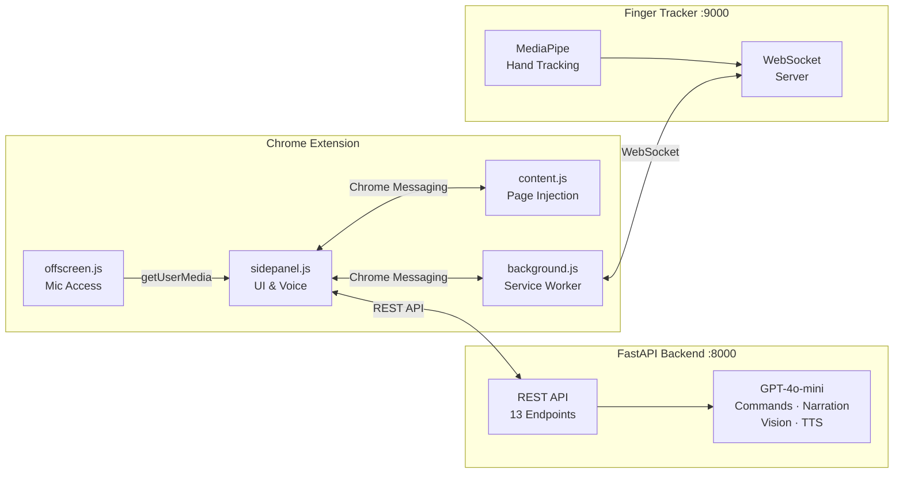

# AccessFlow

**AI-Powered Adaptive Accessibility Companion**

> Make any website accessible — no developer changes required.

[](https://python.org)
[](https://developer.mozilla.org/en-US/docs/Web/JavaScript)
[](https://developer.chrome.com/docs/extensions/mv3/)
[](https://fastapi.tiangolo.com)
[](https://openai.com)
[](LICENSE)

> **Demo screenshots/GIF coming soon**

---

## The Problem

Over **1 billion people** worldwide live with some form of disability, yet the vast majority of websites fail basic WCAG compliance. Accessibility fixes are developer-dependent — users shouldn't have to wait for site owners to retrofit their pages.

## The Solution

AccessFlow is a Chrome extension that **injects accessibility features directly into any webpage at runtime**. Powered by GPT-4o-mini, it combines voice control, hand gesture tracking, AI-powered page adaptation, and visual accessibility tools into a single companion — no source code changes required.

---

## Features

### Voice & Conversation

**Voice Control** — Continuous listening via Web Speech API with natural language commands ("click login", "search for shoes", "scroll down"). GPT-4o-mini interprets ambiguous commands by analyzing interactive page elements. Supports echo cancellation and conversation context. Toggle with `Ctrl+Shift+V` / `Cmd+Shift+V`.

**Read Page (Narration)** — AI generates a structured overview of any webpage with clickable topic chips. Conversational follow-ups let you ask questions about what was just read. "Read Everything" mode provides sequential narration of all sections. Natural TTS via OpenAI API with browser fallback.

### Motor Accessibility

**Finger/Gesture Tracking** — Real-time hand tracking via webcam using MediaPipe + OpenCV. Point your index finger to move a virtual cursor, form an L-shape to click, pinch and drag to scroll. Runs as a subprocess with WebSocket bridge on port 9000.

**Task Tunnel** — Step-by-step form navigation for long or complex forms. Highlights one field at a time with a floating overlay showing Prev/Next/Exit controls and step counter. Supports voice input for text fields and auto-detects dynamically added form fields via MutationObserver.

### Visual Accessibility

**Color Blind Filters** — Supports Deuteranopia, Protanopia, and Tritanopia with two modes: Correct (Daltonization) shifts indistinguishable colors into visible channels, and Simulate shows what the page looks like through color-blind eyes. Implemented via SVG `feColorMatrix` using Machado 2009 matrices.

**Dyslexia Mode** — Applies OpenDyslexic font, reading ruler, color overlays (yellow/blue/pink/green), and bionic reading to improve readability for users with dyslexia.

**Inclusive Mode** — Increases font size (adjustable 10–40px slider), line height, letter spacing, and tap target sizes. Works on dynamic sites via MutationObserver and injects into Shadow DOM for web component support.

**AI Page Simplification** — One-click AI analysis sends page structure to GPT-4o-mini, which generates targeted CSS rules to reduce visual complexity — hiding clutter, improving spacing, and enhancing readability.

### Cognitive Accessibility

**Focus Mode** — Hides distracting elements (ads, popups, sidebars, cookie banners) at three intensity levels: Light (ads/popups only), Medium (+ sidebars, nav, footer), and Strong (+ headers, comments, social buttons). Uses opacity fading to avoid layout shifts.

**Describe Images** — Finds all meaningful images on a page (skips decorative ones), then GPT-4o-mini with vision generates natural descriptions. Sequential auto-narration with Next/Stop controls.

### Analysis & Personalization

**Accessibility Scoring** — Scans the page against 7 WCAG-based categories (contrast, alt text, tap targets, headings, form labels, ARIA, keyboard navigation). Produces a score out of 100 with letter grade, per-category breakdown with issue highlighting, and before/after comparison when AccessFlow features are activated.

**Auto-Suggest** — Analyzes page metrics on load (font sizes, nav link count, word density, missing alt text) and suggests relevant accessibility modes via a dismissible banner.

**User Profiles** — Saves active modes, font size, intensity level, color blind filter/mode to Chrome storage. Auto-applies saved preferences on extension load with configurable auto-start options.

---

## Architecture



---

## Tech Stack

| Component | Technology |
|-----------|-----------|
| Extension | Chrome Manifest V3 + Side Panel API |
| Backend | FastAPI + Uvicorn (Python) |
| AI | GPT-4o-mini (commands, narration, vision, simplification, TTS) |
| Speech | Web Speech API (STT), OpenAI TTS (narration) |
| Gestures | MediaPipe + OpenCV + WebSockets |
| Color Blind | SVG feColorMatrix (Machado 2009 matrices) |
| Storage | Chrome Storage API (sync + local) |

## API Endpoints

| Method | Endpoint | Description |
|--------|----------|-------------|
| GET | `/` | API status |
| GET | `/health` | Health check |
| POST | `/api/interpret-command` | AI voice command interpretation |
| POST | `/api/simplify` | AI page simplification (CSS rules) |
| POST | `/api/describe-images` | GPT-4o-mini vision image descriptions |
| POST | `/api/narrate-page` | Full page narration |
| POST | `/api/narrate-overview` | Page overview + topic extraction |
| POST | `/api/narrate-topic` | Conversational topic narration |
| POST | `/api/tts` | OpenAI text-to-speech (audio/mpeg) |
| POST | `/api/accessibility-summary` | AI accessibility report summary |
| POST | `/api/finger-tracker/start` | Start hand tracking subprocess |
| POST | `/api/finger-tracker/stop` | Stop hand tracking |
| GET | `/api/finger-tracker/status` | Tracker running status |

## Quick Start

### Prerequisites

- Python 3.8+
- Google Chrome
- OpenAI API key

### 1. Install & configure

```bash
git clone https://github.com/ajiteshmanoj/AccessFlow.git
cd AccessFlow/accessflow-backend
python -m venv venv
source venv/bin/activate        # macOS/Linux (see SETUP.md for Windows)
pip install -r requirements.txt
cp .env.example .env            # then add your OPENAI_API_KEY
```

### 2. Start the backend

```bash
cd ..
python start-accessflow.py
```

### 3. Load the extension

1. Open `chrome://extensions` and enable **Developer mode**
2. Click **Load unpacked** → select the `accessflow-extension` folder

### 4. Use it

Open any website, click the AccessFlow icon to open the side panel, and try voice commands like "search for shoes", "simplify page", or "describe images".

> **Platform-specific instructions, troubleshooting, and Windows setup** → [SETUP.md](SETUP.md)

## Voice Commands

### Page Interaction

| Command | Action |
|---------|--------|
| "click [element]" | Click a button, link, or interactive element |
| "search for [query]" | Find search box, type query, and submit |
| "type [field] [text]" | Type text into a specific input field |
| "highlight [element]" | Highlight an element on the page |
| "scroll down / up" | Scroll the page |
| "go back / forward" | Browser navigation |
| "close ad / popup" | Find and click close buttons |
| "first / second article" | Click nth element by type |

### Extension Features

| Command | Action |
|---------|--------|
| "inclusive mode" | Toggle Inclusive Mode |
| "focus mode" | Toggle Focus Mode |
| "simplify page" | Toggle AI simplification |
| "color blind" | Toggle color blind filter |
| "read page" | Start page narration |
| "describe images" | Describe images with AI |
| "finger tracking" | Start gesture control |
| "bigger text" / "smaller text" | Adjust font size |
| "reset" | Reset all modes |

## Project Structure

```
AccessFlow/
├── accessflow-backend/              # Python FastAPI backend
│   ├── main.py                      # API server (13 endpoints)
│   ├── finger_tracker.py            # MediaPipe hand tracking + WebSocket
│   ├── hand_landmarker.task         # MediaPipe model file
│   ├── requirements.txt             # Python dependencies
│   └── .env.example                 # Environment variables template
│
├── accessflow-extension/            # Chrome Extension (Manifest V3)
│   ├── manifest.json                # Extension configuration
│   ├── background.js                # Service worker + WebSocket relay
│   ├── content.js                   # Page injection (modes, filters, commands)
│   ├── sidepanel.html               # Side panel UI
│   ├── sidepanel.js                 # Side panel logic + voice + state
│   ├── offscreen.html               # Offscreen document for mic access
│   ├── offscreen.js                 # getUserMedia prompt handler
│   ├── styles.css                   # Extension styling
│   ├── fonts/                       # OpenDyslexic font files (.woff2)
│   ├── icons/                       # Extension icons (16/48/128px)
│   └── LICENSE                      # MIT License
│
├── start-accessflow.py              # Cross-platform startup script
├── start-accessflow.sh              # macOS/Linux startup
├── start-accessflow.bat             # Windows startup
├── stop-accessflow.py               # Cross-platform stop script
├── stop-accessflow.sh               # macOS/Linux stop
├── stop-accessflow.bat              # Windows stop
├── SETUP.md                         # Detailed setup & troubleshooting
├── LICENSE                          # MIT License
└── README.md
```

## License

This project is licensed under the MIT License — see the [LICENSE](LICENSE) file for details.

## Contributors

| Name | GitHub |
|------|--------|
| Ajitesh | [ajiteshmanoj](mailto:ajiteshmanoj@gmail.com) |
| Cheng Yu | [chongchengyuccy](mailto:chongchengyuccy@gmail.com) |
| Jian Hao | [jjianhhao](mailto:hojianhao2003@gmail.com) |
